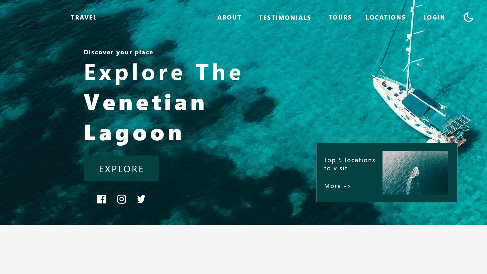
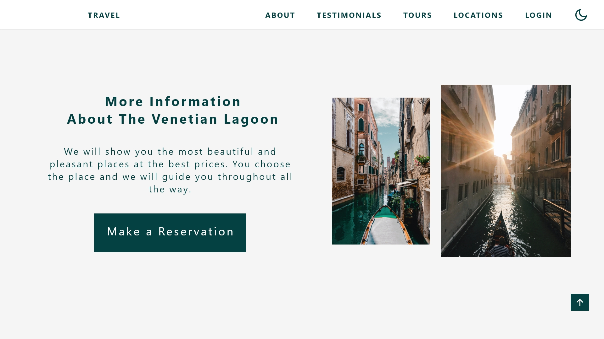
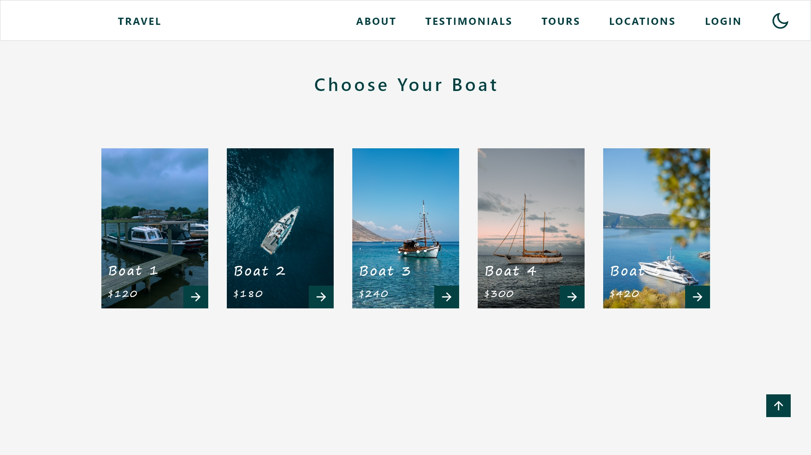
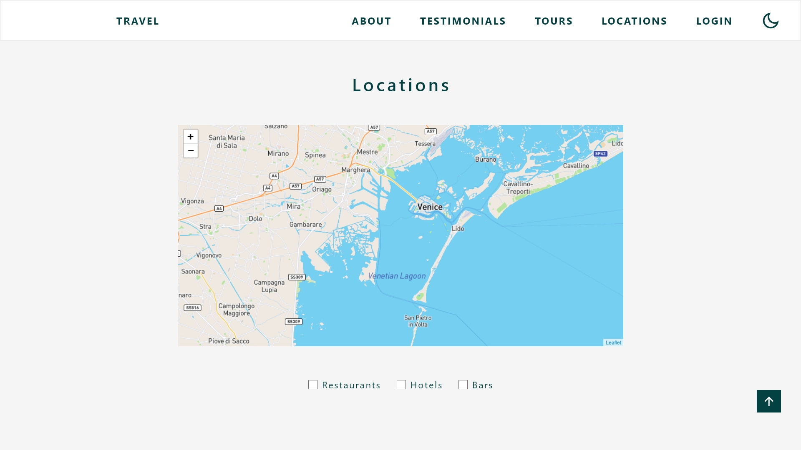
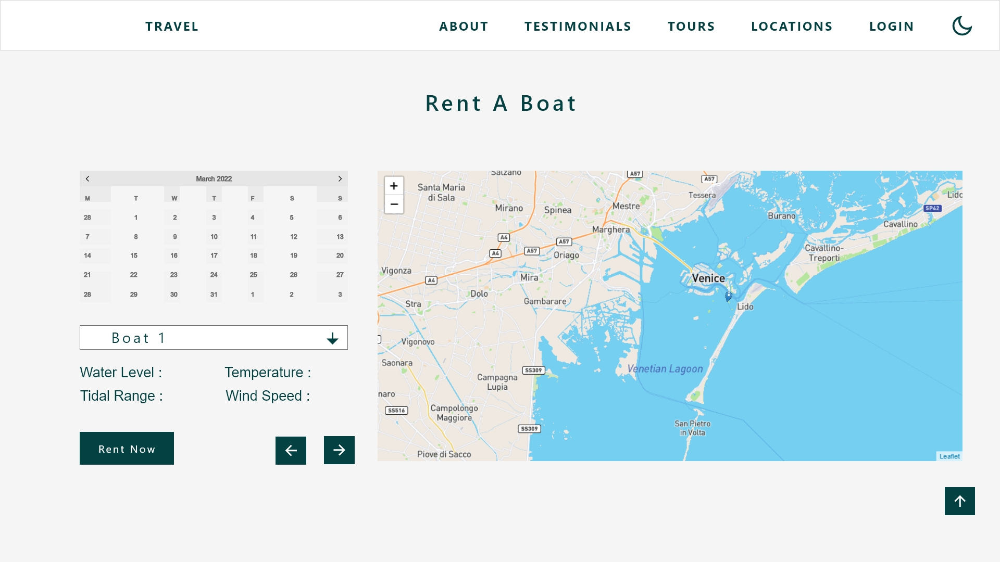
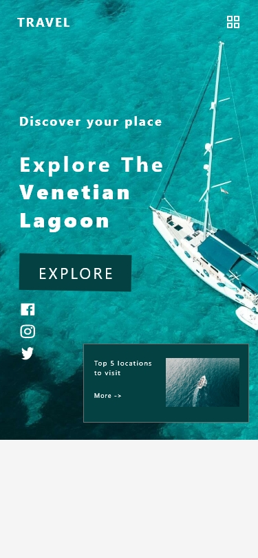

# Venetian Lagoon

A travel booking platform for the Venetian Lagoon, built as a university project at Heilbronn University of Applied Sciences (2022).

## Tech Stack

- **Backend:** Node.js, Express, MariaDB
- **Frontend:** HTML, CSS, JavaScript
- **Auth:** JWT, bcrypt
- **Maps:** Leaflet, Mapbox
- **Features:** Boat booking, island ratings, logbook, testimonials, Google Calendar integration, dark mode

## Screenshots

### Home

### About

### Testimonials

### Boat Selection

### Locations (Leaflet Map)

### Mobile View

